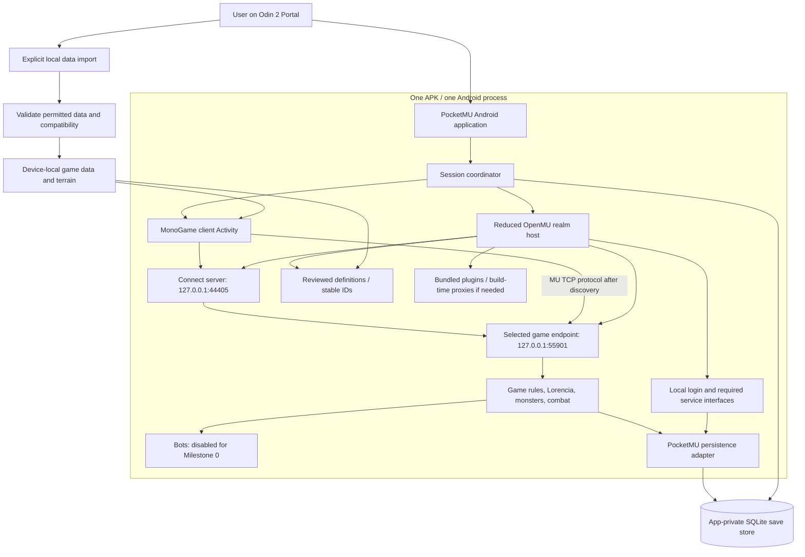
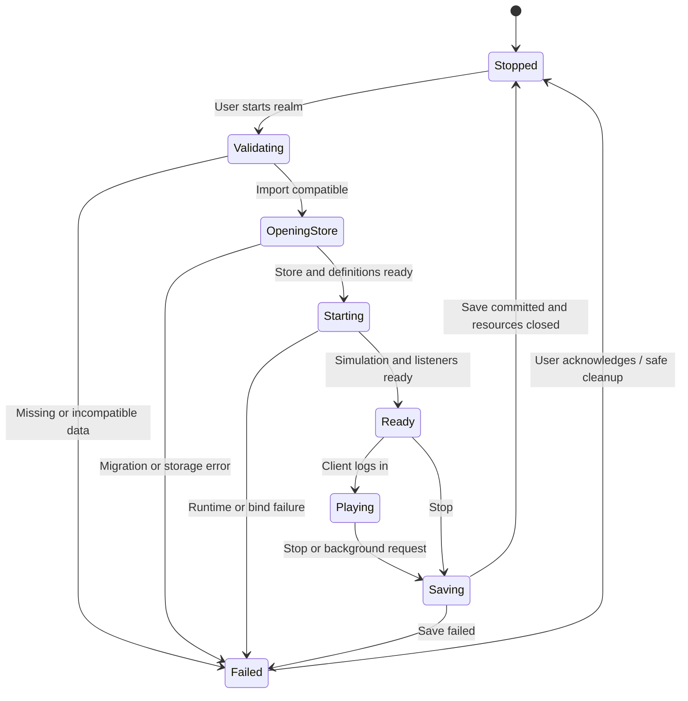

# Proposed PocketMU architecture

Status: Phase 0 design, not implemented or performance-validated. See [feasibility](PHASE_0_FEASIBILITY.md) for evidence and open gates.

## Decision

Build one .NET 10 Android application with a MonoGame client and a reduced OpenMU realm in the same process. Preserve the MU network protocol across a loopback boundary. Separate the realm's lifecycle from the rendering Activity so recreating the screen does not create a second server.

The preferred client candidate is the newer related MonoGame lineage, conditional on clear reuse permission. Otherwise reassess the original client; do not silently replace it or assume either public repository is permissively licensed.

There is no internet, Docker, PostgreSQL daemon, web-admin server, remote account system or Dapr sidecar in this proposed runtime. GitHub Actions provides builds before installation; it is not a gameplay dependency.

Ports above are **PocketMU's proposed explicit single-profile assignments**. Stock upstream initialization creates multiple profile endpoints. Bind sockets to loopback as well as returning loopback in discovery; changing only the advertised address is insufficient.

## Responsibilities and boundaries

| Component | Responsibility |
| --- | --- |
| Android application / session coordinator | Own exactly one realm, explicit async start/stop, readiness, import selection, errors and background transition |
| Client | Draw the world, accept touch/controller actions, send MU packets, apply server responses |
| Realm host | Compose reviewed OpenMU libraries; no desktop Startup executable or admin web host |
| Local service implementations | Login/session bookkeeping and the guild/friend contracts required by GameServer; avoid silent no-op substitutes |
| Gameplay | Server-authoritative state, combat, monsters, drops and experience |
| Persistence adapter | Authentication and state reconstruction, atomic save transactions, migrations and failure reporting |
| Definition loader | Stable configuration IDs, reviewed seeds, imported matching collision terrain |
| Plugin registration | Known built-in plugins; avoid device-side source compilation where the Android runtime cannot support it |
| Importer | User-selected legally obtained files; validation and device-private storage; no automatic downloading |

## Lifecycle contract

The OS can terminate the process from any state; the diagram is the cooperative path, not a guarantee that final callbacks run. Durable checkpoints protect the last committed state. A failed save must not be reported as successful.

- Before launch, validate data and database schema; refuse incompatible versions without overwriting saves.
- Start on worker tasks. Allow discovery/login only after the realm reports ready.
- During play, periodically checkpoint and save key state transitions with a documented loss window.
- On deliberate Stop, stop new work, disconnect/save the player, stop timers/simulation, commit, then release ports and the database.
- On backgrounding, request a checkpoint promptly and stop/suspend deliberately. Milestone 0 does not promise continued play in the background.
- On resume/relaunch, reopen the store, reconstruct state, start once and reconnect. Do not use Environment.Exit as normal shutdown.
- An occupied port is a visible startup error, not a reason to connect to an unrelated service.
- Cancel old receive loops before reconnecting; clear stale scene state and avoid duplicate login sessions.

## Persistence contract

Proposed storage is SQLite behind IPersistenceContextProvider and its required contexts. This is a new adapter, not the existing PostgreSQL EF provider with a renamed connection string.

A narrow first implementation may use indexed account/character identity rows and versioned aggregate DTOs stored transactionally. Definitions are resolved by stable IDs from a pinned configuration version. Persist all state touched by the POC, including character class/name, level/XP, allocated stats, money, map/location, inventory/item properties and learned skills. Do not persist transient rendering or networking objects.

Transactions must prevent half-written inventory or duplicate character records. A deliberate save acknowledgment means SQLite has committed. Abrupt termination may lose only changes since the last acknowledged checkpoint, not corrupt prior state. Test recovery and migration before advancing.

The existing InMemory provider is permitted only for an explicitly temporary host/protocol spike; it cannot satisfy Milestone 0.

## Runtime and dependency constraints

Align the client with the current .NET 10 server libraries. Begin with normal .NET for Android ARM64 deployment; defer NativeAOT, aggressive trimming and performance tuning.

First prove OpenMU plugin dispatch. If runtime Roslyn compilation fails because bundled assembly metadata is unavailable, generate the needed proxies at build time, preserving their invocation behavior. This is a bounded adaptation, not a rewrite of game rules.

Do not package upstream terrain resources just because they are embedded in a .NET assembly. Audit the full build graph and its content manifests. App-private imported files must supply compatible terrain where required.

## Future process boundary

A non-exported Android service, possibly in a separate process, is reserved for a later demonstrated need. It adds lifecycle/IPC contracts, memory use and service-policy work. Loopback TCP lets the renderer remain largely unchanged if this move becomes worthwhile.

Large bot populations, always-running realms and polished launcher flows remain outside Milestone 0.
